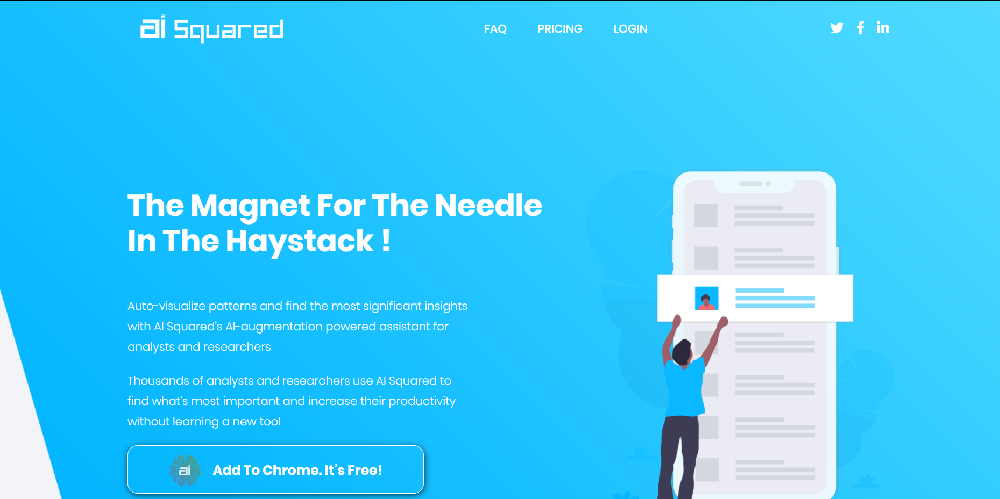
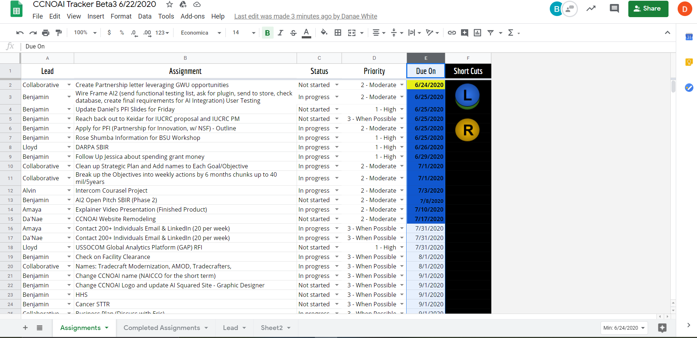
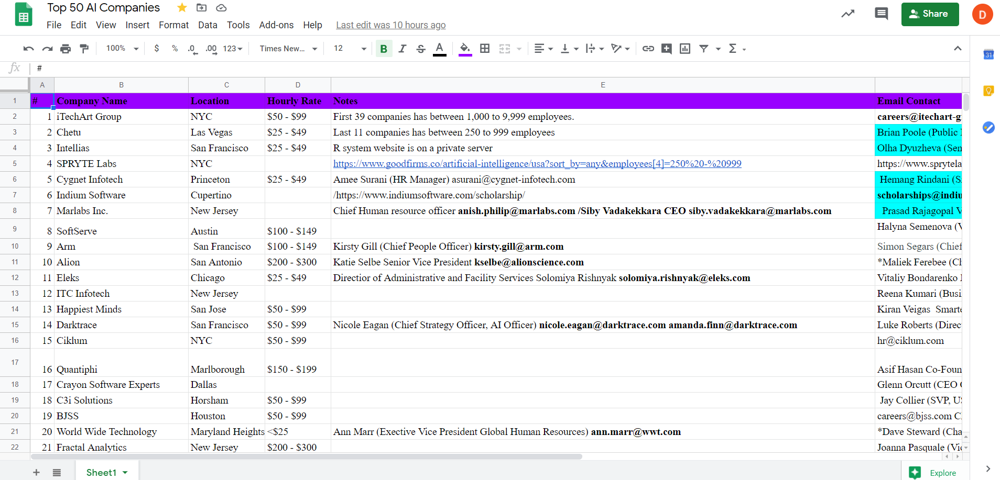

  

      <ul class="nav">
          <li><a href="https://github.com/DaNaeEWHite/DaNaeEWHite.github.io/blob/master/assets/DA%E2%80%99NAEWHITE.pdf">cv</a></li>
          <li><a href="https://github.com/DaNaeEWHite">github</a></li>
          <li><a href="https://medium.com/@danae.white/the-golden-opportunity-352d497f6497">blog</a></li>
          <li><a href="https://www.linkedin.com/in/da-nae-white-800541189/">LinkedIn</a></li>
      </ul>
  

### Portfolio

<table class="wide">
<tr>
  <td class="left">
    
  </td>
  <td class="right">
    
  </td>
</tr>
<tr>
  <td class="left">
    
  </td>
  <td class="right">
    
  </td>
</tr>
</table>

  

      <ul class="nav">
          <li><a href="morefigs.html">see more figures</a></li>
      </ul>
  

